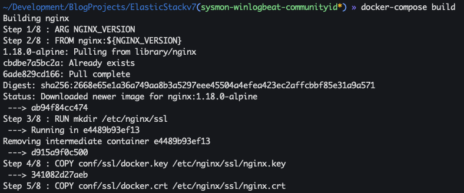
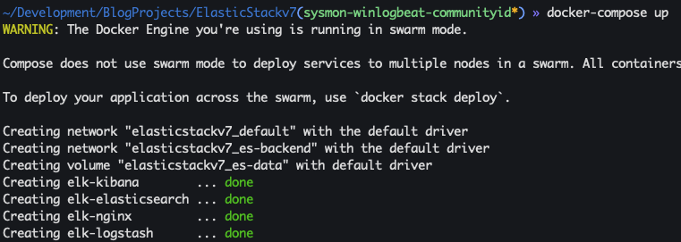
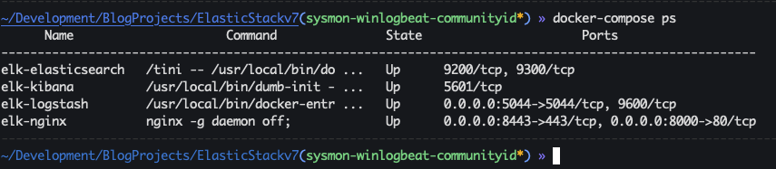
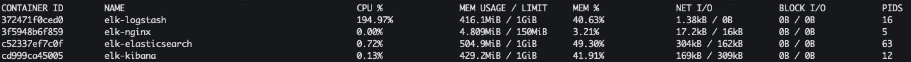

# Elastic (ELK) static v7.7

This directory contains code to run an Elastic stack in a homelab and SHOULD NOT be used in production. The code is meant to be a proof of concept for the blog post below.

## Updated
This repo has been updated on 5-23-2020

## Blog post
* [Back in the saddle: Install/Setup Elastic stack 7.0 on Ubuntu 18.04](https://holdmybeersecurity.com/2019/05/01/back-in-the-saddle-install-setup-elastic-stack-7-0-on-ubuntu-18-04/)

## .env
The Docker images are pinned to the following version below. If you want a different version please update `.env`.
All the configs in this directory have been configured and tested to work with the versions pinned below.
```
NGINX_VERSION=1.18.0-alpine
ELASTIC_VERSRION=7.7.0
```

## Generate OpenSSL certs
1. `openssl req -x509 -nodes -days 3650 -newkey rsa:2048 -keyout conf/ssl/docker.key -out conf/ssl/docker.crt`
1. `openssl dhparam -out conf/ssl/dhparam.pem 2048`

## Spin up an ELK stack
1. `docker-compose build`
  1. 
1. `docker-compose up -d`
  1. 
1. `docker-compose ps`
  1. 
1. `docker stats`
  1. 

## System requirements
* 4 CPU cores
* 4 GBs of RAM
* 60 GB of HDD


## References
* [DockerHub - NGINX](https://hub.docker.com/_/nginx?tab=tags)
* [Dockerhub - Logstash](https://hub.docker.com/_/logstash)
* [Dockerhub - Kibana](https://hub.docker.com/_/kibana)
* [Dockerhub - Elasticsearch](https://hub.docker.com/_/elasticsearch)
* [[Solved] Initial Heap Size Set To A Larger Value Than The Maximum Heap Size](https://javahungry.blogspot.com/2020/04/initial-heap-size-larger-value-maximum-heap-size.html)
* [Github - CptOfEvilMinions/BlogProjects - ElasticStackv7](https://github.com/CptOfEvilMinions/BlogProjects/tree/master/ElasticStackv7)
* [Redirect HTTP to HTTPS in Nginx](https://bjornjohansen.no/redirect-to-https-with-nginx)
* [Dev-Dipesh/ELK with Nginx.md](https://gist.github.com/Dev-Dipesh/2ac30a8a01afb7f65b2192928a875aa1)
* [How To Create a Self-Signed SSL Certificate for Nginx in Ubuntu 18.04](https://www.digitalocean.com/community/tutorials/how-to-create-a-self-signed-ssl-certificate-for-nginx-in-ubuntu-18-04)
* []()
