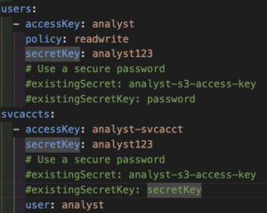

# k8s-jupyter-spark-minio

Working PoC of JupyterHub running jobs on Apache Spark with Minio as a storage backend all running on Kubernetes (k8s).


## Init
1. Create a namespace: `kubectl create ns <namespace>`
1. Create password for minio root user: `kubectl create secret generic minio-root-secret -n <namespace> --from-literal=rootUser=root --from-literal=rootPassword=$(openssl rand -base64 32 | tr -cd '[:alnum:]')`
1. By default the Helm chart will set the `analyst` user password and secretKey to `analyst123`
    1. Uncomment the following lines and run the following command
        1. 
    1. Create password for minio analyst user: `kubectl create secret generic analyst-s3-access-key -n foxship --from-literal=username=analyst --from-literal=password=$(openssl rand -hex 20) --from-literal=secretKey=analyst`

## Deploy
1. Deploy Helm chart: `helm install <release name> . -f values.yaml -n foxship`
```shell
NAME: datalake
LAST DEPLOYED: Fri Feb 16 12:29:37 2024
NAMESPACE: foxship
STATUS: deployed
REVISION: 1
TEST SUITE: None
```

1. `kubectl get pods -n foxship -w`
```shell
➜  k8s-jupyter-spark-minio git:(main) ✗ kubectl get pods -n foxship -w
NAME                              READY   STATUS    RESTARTS   AGE
proxy-7cddbd8676-xzsj8            1/1     Running   0          38s
user-scheduler-d59df85b6-66lcs    1/1     Running   0          38s
continuous-image-puller-fv4gs     1/1     Running   0          38s
datalake-spark-master-0           0/1     Running   0          38s
continuous-image-puller-dd6pq     1/1     Running   0          38s
continuous-image-puller-d9bkq     1/1     Running   0          38s
datalake-spark-worker-0           0/1     Running   0          38s
user-scheduler-d59df85b6-hlwd8    1/1     Running   0          38s
continuous-image-puller-76hkd     1/1     Running   0          38s
datalake-minio-7cbc5d77f9-6ff4l   1/1     Running   0          38s
hub-57cddb887f-dnc52              1/1     Running   0          38s
datalake-spark-worker-0           0/1     Running   0          42s
datalake-spark-worker-0           1/1     Running   0          42s
datalake-spark-master-0           1/1     Running   0          42s
datalake-spark-worker-1           0/1     Pending   0          0s
datalake-spark-worker-1           0/1     Pending   0          0s
datalake-spark-worker-1           0/1     ContainerCreating   0          0s
datalake-spark-worker-1           0/1     ContainerCreating   0          1s
datalake-spark-worker-1           0/1     Running             0          2s
```


## References
* [Project-Obsidian-DC30](https://github.com/blueteamvillage/Project-Obsidian-DC30)
* [Python | os.path.basename() method](https://www.geeksforgeeks.org/python-os-path-basename-method/)
* [MinIO Python Client SDK for Amazon S3 Compatible Cloud Storage](https://min.io/docs/minio/linux/developers/python/minio-py.html)
* [Introduction to PySpark JSON API: Read and Write with Parameters](https://medium.com/@uzzaman.ahmed/introduction-to-pyspark-json-api-read-and-write-with-parameters-3cca3490e448)
* [DataOps 02: Spawn up Apache Spark infrastructure by using Docker](https://medium.com/@ongxuanhong/dataops-02-spawn-up-apache-spark-infrastructure-by-using-docker-fec518698993)
* [helm/jupyterhub/jupyterhub](https://artifacthub.io/packages/helm/jupyterhub/jupyterhub)
* [helm/bitnami/spark](https://artifacthub.io/packages/helm/bitnami/spark)
* [Getting Started With Apache Spark, Python and PySpark](https://towardsdatascience.com/working-with-apache-spark-python-and-pyspark-128a82668e67)
* [Mount Environment Variables Safely with Kubernetes Secrets and Helm chart](https://medium.com/gammastack/mounting-environment-variables-safely-with-kubernetes-secrets-and-helm-chart-764420dc787b)
* [Spark on Kubernetes: Jupyter and Beyond](https://www.oak-tree.tech/blog/spark-kubernetes-jupyter)
* [unzip password protected zip in unix](https://stackoverflow.com/questions/42186512/unzip-password-protected-zip-in-unix)
* [What is a medallion architecture?](https://www.databricks.com/glossary/medallion-architecture)
* [jupyter/all-spark-notebook](https://hub.docker.com/r/jupyter/all-spark-notebook)
* [com/amazonaws/aws-java-sdk-s3/1.11.1026](https://repo1.maven.org/maven2/com/amazonaws/aws-java-sdk-s3/1.11.1026/)
* [com/amazonaws/aws-java-sdk/1.11.1026/aws-java-sdk-1.11.1026.jar](https://repo1.maven.org/maven2/com/amazonaws/aws-java-sdk/1.11.1026/aws-java-sdk-1.11.1026.jar)
* [org/apache/hadoop/hadoop-aws/3.3.2/hadoop-aws-3.3.2.jar](https://repo1.maven.org/maven2/org/apache/hadoop/hadoop-aws/3.3.2/hadoop-aws-3.3.2.jar)
* [com/amazonaws/aws-java-sdk-core/1.11.1026/aws-java-sdk-core-1.11.1026.jar](https://repo1.maven.org/maven2/com/amazonaws/aws-java-sdk-core/1.11.1026/aws-java-sdk-core-1.11.1026.jar)
* [com/amazonaws/aws-java-sdk-bundle/1.11.1026/aws-java-sdk-bundle-1.11.1026.jar](https://repo1.maven.org/maven2/com/amazonaws/aws-java-sdk-bundle/1.11.1026/aws-java-sdk-bundle-1.11.1026.jar)
* [com/amazonaws/aws-java-sdk-s3/1.11.1026/aws-java-sdk-s3-1.11.1026.jar](https://repo1.maven.org/maven2/com/amazonaws/aws-java-sdk-s3/1.11.1026/aws-java-sdk-s3-1.11.1026.jar)
* [AWS SDK For Java Bundle » 1.11.1026](https://mvnrepository.com/artifact/com.amazonaws/aws-java-sdk-bundle/1.11.1026)
* [AWS SDK For Java Core » 1.11.1026](https://mvnrepository.com/artifact/com.amazonaws/aws-java-sdk-core/1.11.1026)
* [AWS Java SDK :: Services :: Amazon S3 » 2.18.41](https://mvnrepository.com/artifact/software.amazon.awssdk/s3/2.18.41)
* [Apache Hadoop Amazon Web Services Support » 3.3.2](https://mvnrepository.com/artifact/org.apache.hadoop/hadoop-aws/3.3.2)
* [Spark – How to fix “WARN TaskSchedulerImpl: Initial job has not accepted any resources”](https://arnesund.wordpress.com/2015/08/19/spark-how-to-fix-warn-taskschedulerimpl-initial-job-has-not-accepted-any-resources/)
* []()
* []()
* []()
